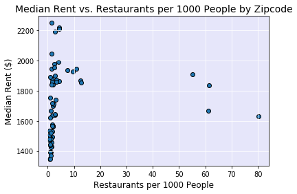
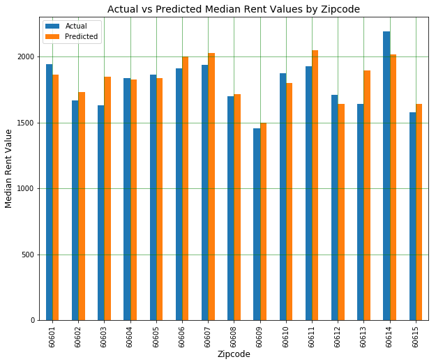

# Project: Chicago Housing Prices

For this project we explored what factors may influence the value of housing in Chicago (home values and rental prices).  Based on the conventional wisdom below are the questions we asked and what we discovered:

## Do Median Rent and Median Home Value by Zip Code Follow the Same Trend?
Zillow data from the Quandl API was used to review 2018 median home values and median rental prices in Chicago. Median home values and median rental prices seem to have a correlation coefficient of  0.95.

## Does Having More Amenities Increase the Rental Price in the Area?
The Yelp API was used to locate the number of business in certain categories. And the categories that we felt would be most likely to affect rent prices are: nightlife, restaurants, and grocery stores. 

We discovered that none of the three business types had a strong relationship with median rental price. Nightlife, Restaurants, and Grocery stores had a correlation coefficient of 0.20, 0.11, and 0.26 respectively.

## Do Higher Crime Rates and Higher Poverty Rates Correlate to Lower Rent Prices?

## Crime Rate

The crime data was collected from the city of Chicago data portal for all reported incidents of crime in 2018.
There was not a strong correlation between crime per 1,000 people in each zip code and the median rent in each zip code. The correlation coefficient is -0.04.

## Poverty

The poverty rate data was collected from the US census API.
Poverty rate per zip code is inversely related to median rent. The correlation coefficient is -0.56.

## Is There a Correlation Between the Median Rent Price and Median Household Income?
Using the median rent price from Quandl and the median household income from the 2017 US Census API, we investigated whether median rent is affected by the median household income.  and discovered that median Household income is positively correlated with median rent with a correlation coefficient of 0.66.

## Do Short Term Rentals Such as Airbnb Have an Effect on Rent Prices?
The Airbnb data was pulled from the Inside Airbnb website, and plotted the rent value against average number of reviews. The plot shows that the average number of reviews per Airbnb listing is not strongly correlated with median rent. The correlation coefficient is 0.14.

## Regression Model
In order to verify how well the above variables predicted the rent prices in Chicago, we ran multi-linear regression.  
We ran multiple iterations of the regression model. The final model included the following variables: median household income, poverty rate, total crime count, average Airbnb reviews, total amenities (grocery, nightlife, restaurants). 

The factors when combined together gave a rather good regression model with the R-square value of 0.66 and a p-value of less than 5% for each variable.

